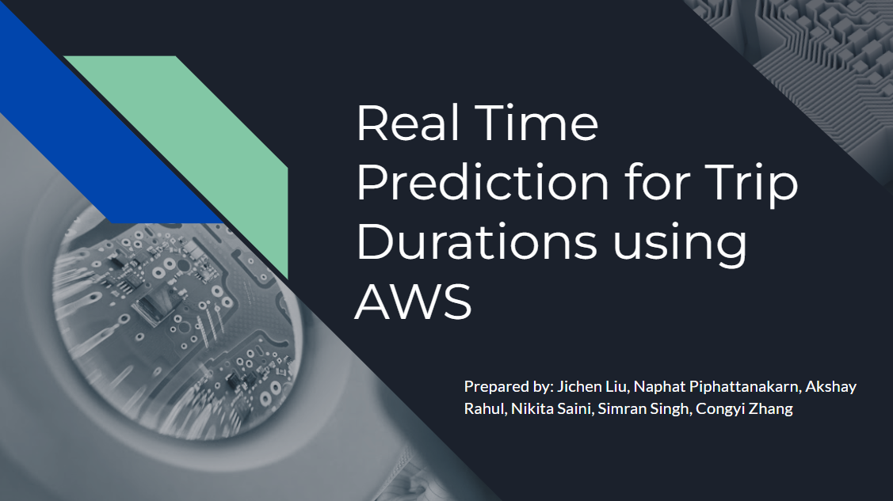
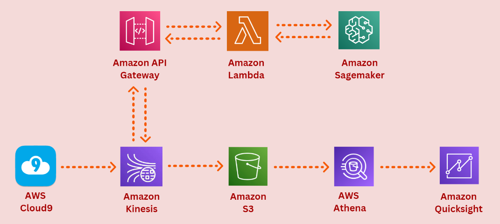

# Real-time predictions of taxi trip durations using AWS

Repository for a Real-time prediction for taxi trip durations using AWS.
This project repository is created in partial fulfillment of the requirements for the Big Data Analytics course offered by the Master of Science in Business Analytics program at the Carlson School of Management, University of Minnesota.

## Business background
In this project, we use AWS services to implement real-time machine learning inference on streming data. The business context in which we will make use of the architechture here is the delivery service industry. 
One clear usecase is for the taxi industry since time is of the essence - be it passengers, drivers, or the company. A crucial aspect of this is estimating the trip duration. Trip duration has many rolling effects – such as demand, pricing, traffic, weather and delays. 
With this real-time inference system, the trip duration prediction would help drivers plan the optimal rides to consider based on the current situation such as traffic and weather, and help customers plan their schedule better. The company can create metrics to monitor the best pricing strategy and balance driver workloads

Presentation video : https://www.youtube.com/watch?v=hcFiFaz7DXU

## Dataset
Our demonstration uses samples from New York City Taxi and Limousine Commission (TLC) Trip Record Data (https://registry.opendata.aws/nyc-tlc-trip-records-pds/)

## Setup instruction
This project derived from the AWS workshop - [Real Time ML inference on Streaming Data](https://catalog.us-east-1.prod.workshops.aws/workshops/63069e26-921c-4ce1-9cc7-dd882ff62575/en-US/lab7#overview) - which utilizes several AWS services. To learn more about the core architecture, please follow the link to see more detailed settings.
All specific details for each service could be found below.

### AWS Sagemaker
Please follow the 2 jupyter notebooks in sagemaker folder to see how to perform data cleaning, data exploration and ML model training and deployment. Small samples of training data are stored in sample_data folder, which could be used as a reference to the structures of the dataset.

### AWS kinesis
Please follow the instructions as shown in the article above for how to setup the Kinesis stream, Kinesis analytic, and Apache flink for real-time streaming.

### AWS lambda and API Gateway
The template to create a lambda function and API Gateway is stored in the cloudformation folder. Please see more detail on how to setup the 2 services in the article. 
The lambda function code to perform data processing and connecting to the Sagemaker Endpoint could be found in the lambda folder.

### AWS S3
Please follow the steps described in the article to create and setup an S3 bucket.

### AWS Cloud9
The python script to simulate the data generation process for Cloud9 can be found in cloud9 folder. The samples of the dataset used for datastream simulation is provided in the sample_data folder, which could be used as a reference to the structures of the dataset. Please follow the instruction in the article to see how to setup a cloud9 environment to run the script.

### AWS Athena
The sql script to create a table to query from the s3 bucket is provided in the athena folder.

### AWS Quicksight
Please follow this [link](https://catalog.us-east-1.prod.workshops.aws/workshops/9981f1a1-abdc-49b5-8387-cb01d238bb78/en-US/30-basics/307-quicksight) to see how to use Quicksight to visualize data from an Athena table.

## Project member
- Naphat Piphattanakarn
- Jichen Liu
- Nikita Saini
- Congyi Zhang
- Akshay Rahul Kumar
- Simran Sing

## Reference
- Real Time ML inference on Streaming Data (https://catalog.us-east-1.prod.workshops.aws/workshops/63069e26-921c-4ce1-9cc7-dd882ff62575/en-US/lab7#overview)
- New York City Taxi and Limousine Commission (TLC) Trip Record Data (https://registry.opendata.aws/nyc-tlc-trip-records-pds/)
- Visualize with QuickSight using Athena (https://catalog.us-east-1.prod.workshops.aws/workshops/9981f1a1-abdc-49b5-8387-cb01d238bb78/en-US/30-basics/307-quicksight)

## Additional Resource
Here are some useful resources to learn more about how to make a variety of visualization on quicksights and how to connect it to other services.
- Local File to S3 to QuickSight Dashboard (https://m.youtube.com/watch?v=olA5ikCuLo0)
- AWS Athena Glue and QuickSight Tutorial | Athena and QuickSight Integration | Serverless Analytics (https://www.youtube.com/watch?v=Cg4DNZcLh5A)
